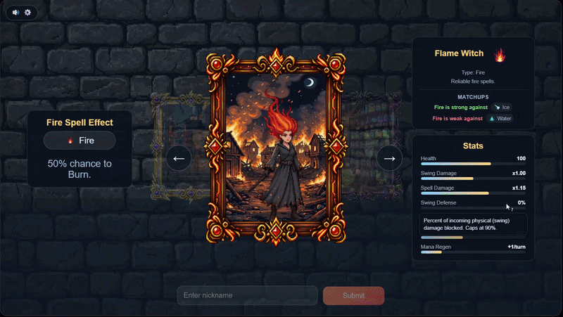
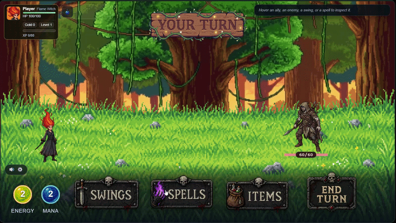
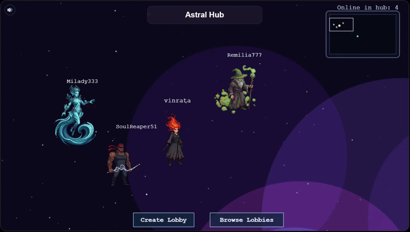
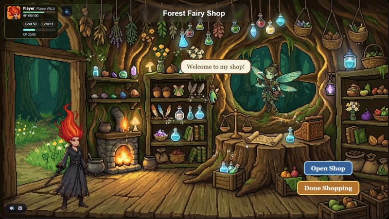
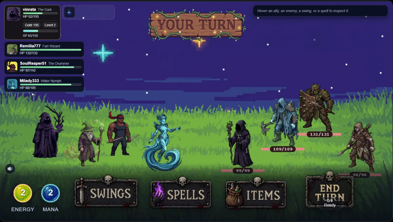

[README.md](https://github.com/user-attachments/files/27366271/README.md)
# SpellSwing

SpellSwing is a browser-playable multiplayer turn-based RPG built with Phaser 3, Node.js, Express, and Socket.IO. Players choose a typed character, meet in a shared hub world, create or join lobbies through portals, then run through combat encounters together.

The project is currently an MVP/work-in-progress game jam build focused on proving the full loop from website entry to multiplayer combat and back to the hub.


   


## Features

- Shared online hub where connected players can see each other move around.
- Lobby creation, joining, ready checks, host-only run start, and direct lobby links with `?lobby=...`.
- Character selection across the game's type system: Fire, Ice, Water, Earth, Lightning, Wind, Poison, Light, and Shadow.
- Server-authoritative turn-based combat over Socket.IO.
- Swings, typed spells, items, defending, passing, status effects, XP, gold, leveling, shops, blessings, and boss encounters.
- Phaser-powered scenes for entry, character select, hub, lobby, run/combat, rewards, and results.
- Vibe Jam portal integration from the browser shell.


  

## Tech Stack

- **Runtime:** Node.js
- **Server:** Express + Socket.IO
- **Client:** Phaser 3 + vanilla JavaScript
- **Assets:** Sprite sheets, music, sound effects, UI art, backgrounds, relics, spell effects, and type icons under `Assets/`


  


  
  

## Getting Started

### Prerequisites

- Node.js 18+ recommended
- npm

### Install

```bash
npm install
```

### Run In Development

```bash
npm run dev
```

This starts the server with `nodemon`.

### Run Normally

```bash
npm start
```

Then open:

```text
http://localhost:3000
```

The server uses `PORT` if provided, otherwise it defaults to `3000`.

## How To Play

1. Open the game in a browser.
2. Enter a nickname and select a character.
3. Move around the hub with `A` / `D` or the arrow keys.
4. Press `E` near a portal, or use the UI buttons, to create or join a lobby.
5. Ready up in the lobby. The host can start the run once the party is ready.
6. In combat, use swings, spells, items, defend, or pass to survive each encounter.
7. Collect XP, gold, blessings, and shop upgrades as the run progresses.

## Project Structure

```text
SpellSwing/
|-- Assets/                    # Game art, audio, VFX, UI, and character assets
|-- public/
|   |-- index.html             # Browser shell
|   |-- styles.css             # Layout and UI styling
|   `-- js/main.js             # Phaser client, UI, and socket handlers
|-- server.js                  # Express server and authoritative game state
|-- type_chart.json            # Single source of truth for type matchups
|-- swings_and_spells.json     # Reference catalog for combat actions
|-- game_design_document.md    # Full design notes
|-- mvp_scope.md               # MVP goals and acceptance criteria
`-- art_asset_inventory.md     # Asset checklist and production notes
```

## Game Design Notes

SpellSwing uses a rock-paper-scissors-style type chart split into three triangles:

- Elemental: Water -> Fire -> Ice -> Water
- Storm: Earth -> Lightning -> Wind -> Earth
- Mystical: Poison -> Light -> Shadow -> Poison

Typed attacks deal increased damage against types they beat, reduced damage against types they lose to, and neutral damage outside their triangle. The authoritative type data lives in `type_chart.json`.

## Development Notes

- `server.js` owns live player sessions, hub presence, lobbies, run state, combat resolution, rewards, shops, and Socket.IO events.
- `public/js/main.js` owns the Phaser scenes, browser UI, client-side presentation, input, overlays, audio, and socket event handling.
- Static assets are served from `public/`, `Assets/`, Phaser's package dist folder, and `phaser3-rex-plugins`.
- There is currently no separate build step; the browser loads the client files directly from the Express server.

## Scripts

```bash
npm run dev   # Start with nodemon
npm start     # Start with node
```

## Status

This repository is an active MVP. The core multiplayer loop is represented in code, while content, balancing, final art, VFX, audio polish, and broader chapter progression are still evolving.
